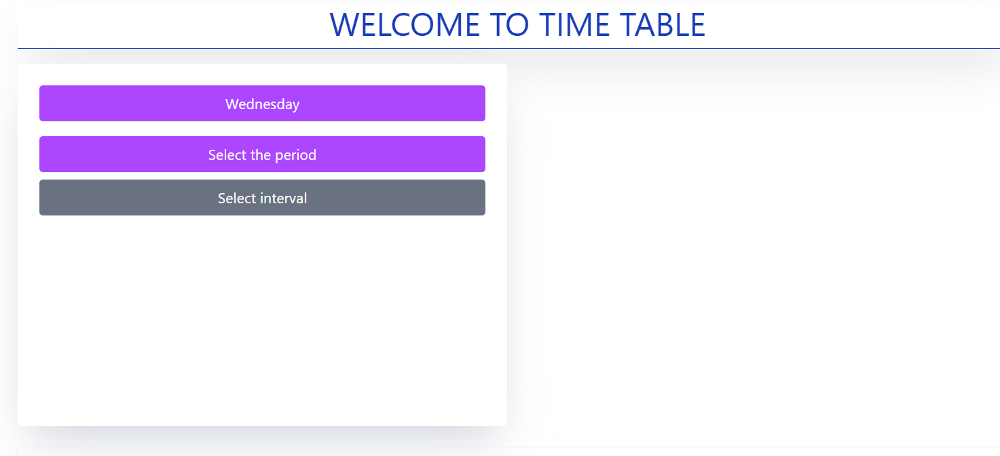
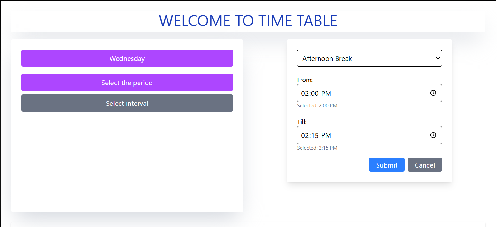
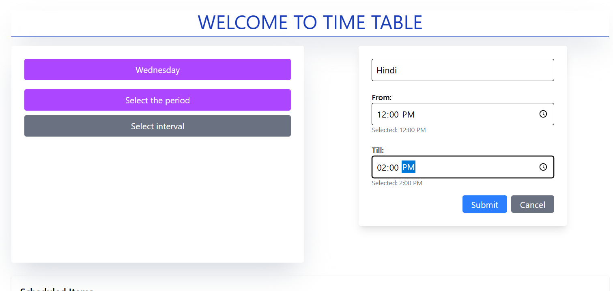
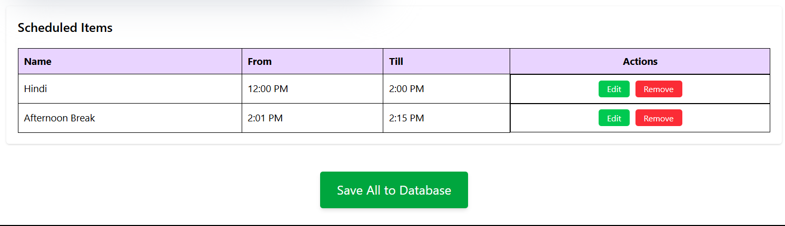

# 🗓️ Timetable Scheduler

A simple full-stack app to manage class schedules using **React**, **Node.js**, and **MySQL**.

---

## 🚀 Features

-   Select weekdays (Mon–Fri)
-   Add subject periods or break intervals
-   View, edit, or delete schedule entries
-   Save selected day’s schedule to MySQL
-   Clean UI with Tailwind CSS

---

## 📂 Tech Stack

-   **Frontend:** React, Tailwind CSS
-   **Backend:** Node.js, Express, MySQL
-   **Database:** MySQL

---

## ⚙️ Setup Instructions

### 1. MySQL

Run the following in MySQL:

```sql
CREATE DATABASE timetable;

USE timetable;

CREATE TABLE schedules (
  id BIGINT PRIMARY KEY,
  subject VARCHAR(255),
  type VARCHAR(50),
  timeFrom VARCHAR(10),
  timeTill VARCHAR(10),
  day VARCHAR(20)
);
```

## 📸 UI Screenshots

### 🏠 Homepage


### ➕ Add Period Popup


### ⏸️ Add Interval Popup


### 📋 Schedule Table


```
🙌 Author
Made by  Noman Ahmed 🦇
Built with ❤️ for learning and practice.```